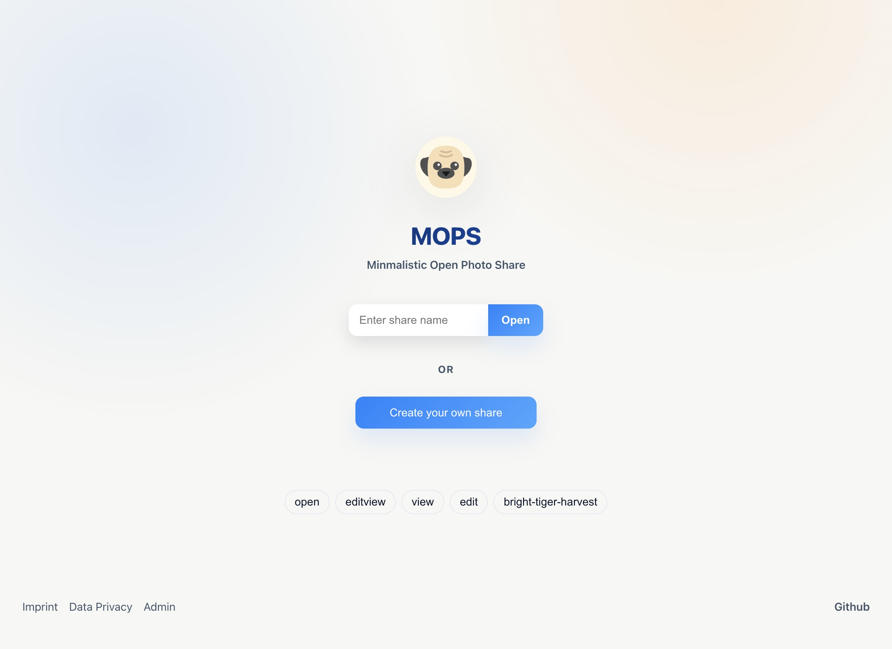
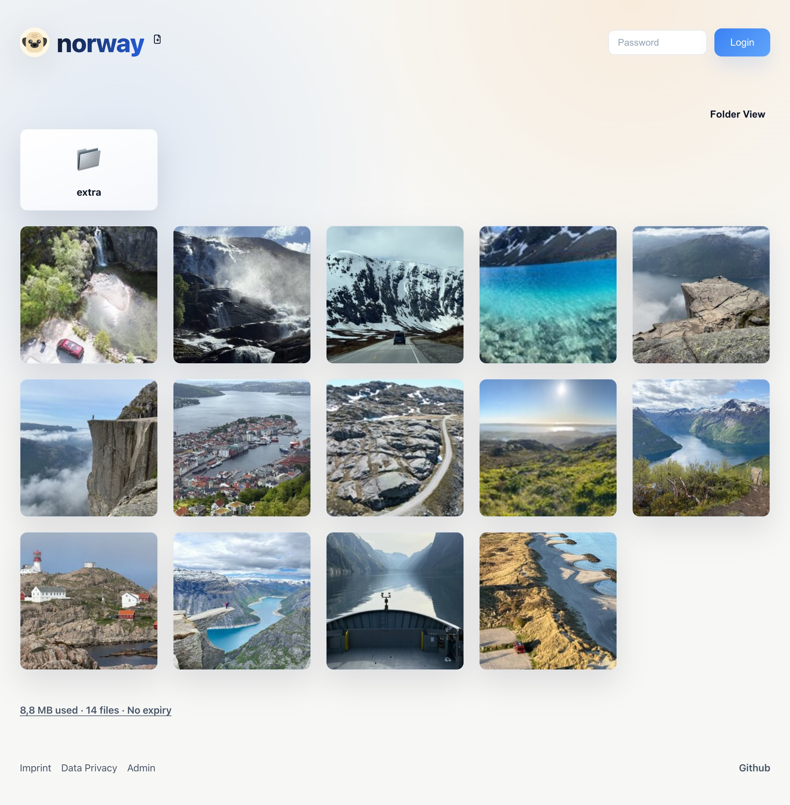
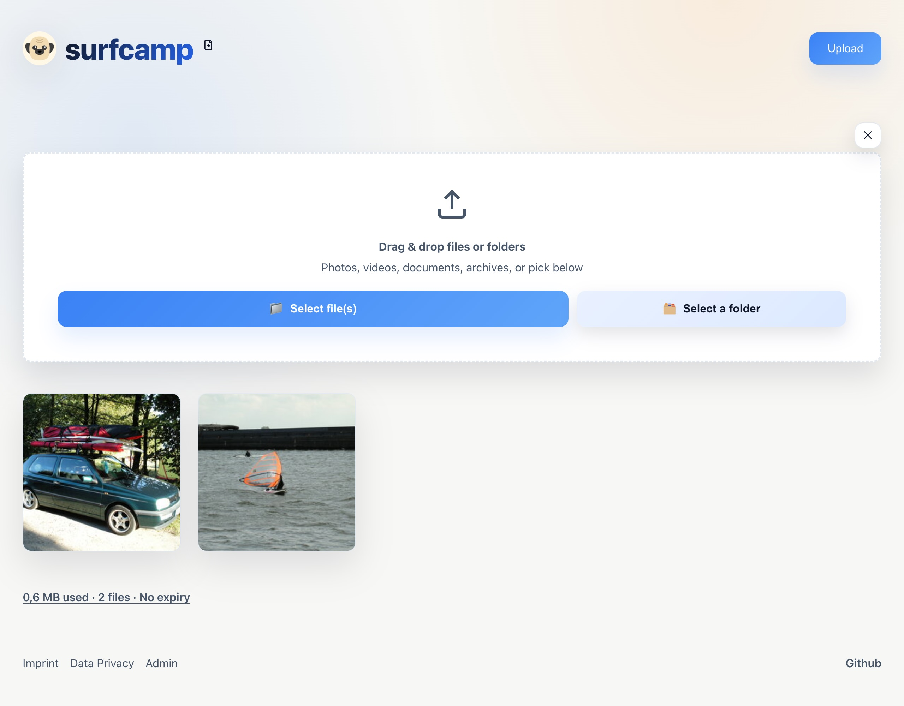

# MOPS – My Own Photo Share

Lightweight self-hosted photo sharing. Upload the `web/` folder to any Apache/PHP host, set an admin password, and start collecting photos from friends with or without upload passwords.

## Features
- Fast, single-folder deploy (`web/`)
- Zero database: stores everything on disk, no SQL setup
- Admin UI at `/admin` to set the password and manage shares
- Optional public share creation: let visitors open their own shares if enabled
- Optional passwordless viewer uploads; per-share passwords supported
- Drag-and-drop multi-upload and whole-directory upload
- Automatic thumbnails via ImageMagick; subfolder browsing
- Zip export of a whole share

## Requirements
- PHP 7.4+ with ImageMagick/imagick enabled
- Apache (or any PHP-capable server) with write access to `web/data/`
- `zip` available on the server for archive downloads

## Quick start
1. Copy `web/` to your host (keep `.htaccess` files).
2. Ensure `web/data/` is writable by the web server user (e.g. `chmod -R u+rwX web/data` or a matching owner).
3. Open `https://yourdomain/admin/` and set the admin password when prompted.
4. Create a share (with or without an upload password).
5. Share the public URL; viewers can upload if allowed. Thumbnails are generated on first view.

## Configuration
Most defaults live in `web/api/settings.json`. Common knobs:
- `maxImageWidth`, `maxImageFileSize`: resize limit and per-image max size.
- `allowPublicGalleryCreation`: allow visitors to create new shares.
- `publicDefault*`: defaults for publicly created galleries (max size, photo count, lifetime).
- `default*`: defaults for admin-created galleries.
- `contactEmail`: shown for contact/help links.

## File layout (key parts)
```
web/
├── index.html      # Public share UI
├── app.js          # Share logic
├── style.css       # Share styles
├── api/            # Public API for listing/viewing
├── admin/          # Admin UI + upload API
└── data/           # Uploaded images and thumbnails (writable)
```

## Security and maintenance
- Admin password is hashed; pick a strong one and keep `/admin` private.
- Keep `web/data/` writable but not listable; `.htaccess` is included.
- Back up `web/data/` regularly; it holds originals and generated thumbs.

## Screenshots





